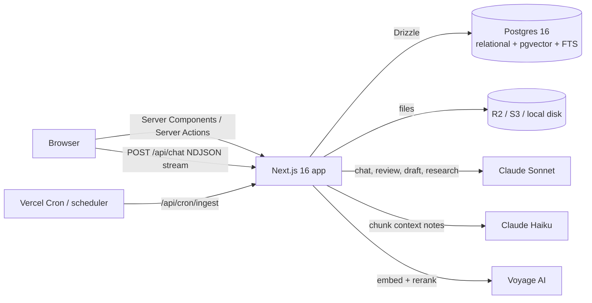

# LawAI architecture

## 1. System overview



A single Next.js application serves the UI, the API and the AI agent. A single Postgres database holds relational data, vectors and full-text indexes. This keeps the MVP cheap to run and, more importantly for law firms, means **permission filters and retrieval execute in the same SQL statement**: there is no second datastore that could leak a confidential matter.

## 2. Data model (src/db/schema.ts)

| Domain | Tables |
|---|---|
| Tenancy and identity | `firms`, `users`, `sessions` |
| Practice | `clients`, `cases`, `case_members` (staffing = access), `events` (hearings, deadlines, meetings), `tasks`, `time_entries`, `jurisdictions`, `deadline_rules` |
| Documents | `documents` (text, page offsets, summary, ingest status, version), `document_versions`, `document_chunks` (vector(1024) HNSW, generated tsvector GIN, context, heading, page) |
| Review | `playbook_rules`, `document_issues` |
| Research | `legal_sources` (vector + tsvector), `research_queries` |
| AI | `conversations` (optional case/document scope), `messages` (sources, tool calls, feedback), `ai_usage` (tokens, latency, feature) |
| Ops | `notifications`, `activities` (audit log) |

Every row carries `firm_id`. This makes the app multi-tenant from day one and allows Postgres row-level security to be added later as defence in depth.

## 3. Access control

`src/lib/access.ts` (pages, actions) and its Python mirror `ai/lawai_ai/access.py` (retrieval and agent tools) apply the same rule:

- `accessibleCaseIds(user)` returns every matter for admins, and only staffed matters for everyone else.
- `caseScope`, `caseIn` and `assertCaseAccess` apply that list to queries.

It is enforced in **every** read model (`src/lib/queries/*`), server action, file download, upload, and in **every AI tool**. The assistant cannot be prompt-injected into revealing another matter, because the tools never return rows outside the user's scope; the model simply never sees them. Firm-wide documents (no matter attached) are visible to the whole firm.

Demo: sign in as `sam@demo.law` and ask about *Mehta v. Arcon*. The assistant finds nothing, and the case URL shows "Not found, or you don't have access".

## 4. Ingestion pipeline (ai/lawai_ai/rag)

```
upload ─► storage ─► parse ─► chunk ─► contextualize ─► embed ─► upsert chunks ─► summary
                    pypdf/    clause-    Haiku, doc     voyage-     HNSW + GIN
                    mammoth   aware      prompt-cached  law-2
```

| Step | File | Detail |
|---|---|---|
| Parse | `parse.py` | PDF via `pypdf` with per-page character offsets, so every chunk knows its page. DOCX via `mammoth`. TXT/MD direct. |
| Chunk | `chunk.py` | Detects clause numbers (`9.2`, `14.`), `ARTICLE`, `SECTION`, `SCHEDULE` and heading lines. Sections are split at 2,400 chars with 400 overlap, and sections under 700 chars are merged with their neighbour. Each chunk stores its heading, so a hit reads "14. Limitation of Liability". |
| Contextualize | `contextualize.py` | Anthropic's *Contextual Retrieval* technique. Haiku writes 1–2 sentences placing the chunk in the document. The whole document is sent once with `cache_control`, so each further chunk costs only the chunk tokens. The note is prepended for both embedding and FTS. Toggle: `RAG_CONTEXTUAL`. |
| Embed | `embeddings.py` | Voyage `voyage-law-2` with `input_type=document/query`; OpenAI `text-embedding-3-large` at 1024 dims as an alternative; `none` disables vectors. |
| Store | `ingest.py` | Replaces a document's chunks atomically, writes a summary, and sets `ingest_status`. Runs in `after()` so the upload responds immediately; `/api/cron/ingest` and `npm run ingest:pending` retry anything stuck. |

## 5. Retrieval (ai/lawai_ai/rag/search.py)

1. **Vector search:** cosine distance on the HNSW index (top 40).
2. **Lexical search:** `ts_rank_cd` over an OR-joined `tsquery` (top 40). This catches exact legal tokens that embeddings blur: "CPLR 213", "clause 9.2", party names.
3. **Reciprocal Rank Fusion** (k = 60) merges both lists without score calibration.
4. **Clause boost:** if the query names a clause number, chunks whose heading starts with it are promoted.
5. **Rerank:** Voyage `rerank-2` over the fused top candidates.
6. **Filters in SQL:** firm, accessible matters, optional case or document scope.

Degrades gracefully: without embeddings it is FTS + clause boost; without a rerank key it uses the fused order.

## 6. The agent (ai/lawai_ai/agent)

- `agent.py` runs a tool-use loop (max 8 steps; the last step must answer) over Claude or Groq and streams NDJSON events, which Next.js relays to the browser: `conversation`, `text`, `tool` (progress labels such as "Checking your calendar"), `sources`, `done`, `error`.
- The system prompt contains the user, firm, jurisdictions, today's date (date only, so the cache stays warm all day) and the active scope (matter or document). It is prompt-cached together with the tool definitions.
- Modes: **chat** (answer from data), **draft** (produce clean drafting text), **research** (prefer legal sources and state uncertainty).

| Tool | Answers |
|---|---|
| `get_schedule` | "When is my next hearing?", "What's on Thursday?" |
| `list_tasks` | "What's due this week?", overdue work |
| `find_cases` / `get_case` | Matter lookup, opposing counsel, judge, team, status |
| `find_clients` / `get_client` | Contacts and the client's matters |
| `search_documents` | Hybrid RAG over the user's documents, returns cited passages |
| `get_document_issues` | Playbook-review findings for a document |
| `search_legal_sources` | Statutes and cases filtered by jurisdiction |
| `calculate_deadline` | Court deadlines from `deadline_rules`, weekend roll-forward |

**Citations.** Each passage a tool returns is registered in a `SourceRegistry` as `S1, S2…`. The model cites `[S1]` inline; the UI renders chips that deep-link to the document and clause. Sources are persisted with the message, so old conversations keep working citations.

**Playbook review** (`review.py`) forces a `report_issues` tool call, then **verifies that each quoted `original_text` is a verbatim substring** of the document and drops any that are not. Hallucinated quotes never reach the lawyer. Accepting an issue applies the replacement, saves a new version and re-ingests.

**Usage accounting.** Every call writes to `ai_usage` (feature, model, tokens, latency), which feeds the Reports screen and future per-seat pricing.

## 7. Security posture

- Sessions: random 256-bit token in an httpOnly, SameSite=Lax, Secure (in prod) cookie; only its SHA-256 is stored. Passwords hashed with bcrypt.
- `src/proxy.ts` redirects unauthenticated requests; every server action and route re-checks the session.
- Inputs validated with zod; uploads restricted by type and size; storage keys are path-traversal safe.
- Security headers: `X-Frame-Options: DENY`, `nosniff`, strict referrer policy, permissions policy.
- Audit log (`activities`) on every mutation.
- AI providers: use zero-data-retention agreements for production client data.

## 8. Scaling path

| Stage | Change |
|---|---|
| First paying firms | Neon/Supabase in-region, R2, Vercel Pro; Sentry; daily backups |
| ~50 firms | Ingestion queue (Inngest / Trigger.dev); OCR; Postgres RLS; SSO (SAML/OIDC) + MFA |
| Enterprise | Dedicated DB per firm or VPC deploy; customer-managed keys; Outlook/Gmail and DMS (iManage, NetDocuments) connectors |
| Quality | Eval set of real questions with gold answers, run on every prompt/model change; answer feedback loop from `messages.feedback` |
| Product | Court-holiday calendars per jurisdiction, conflict checks, billing and invoicing, e-signature, licensed case-law feeds |
